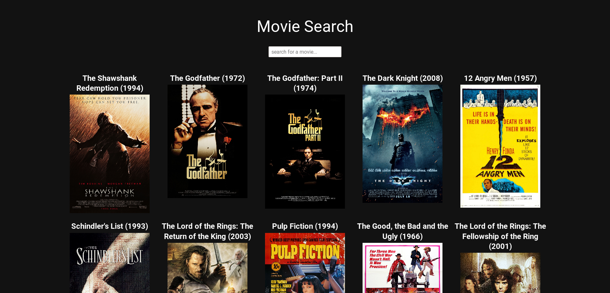

# Movie Search

## About the project

This project was made to practice React. 

## What I learned from this project

- Create React App has Sass ready to go with no additinal setup.
- If CORS header 'Access-Control-Allow-Origin' missing then you need a CORS proxy.
- Web scraping with Xpath using `document.evaluate()`.
- How to make CSS grid responsive with `grid-template-columns: repeat(auto-fill, minmax(300px, 1fr));`.

## How to run

1. clone the project using `git clone git@github.com:DanielLitvak/movie-search.git`.
2. install the packages `npm i`.
3. start with `npm start`.

This project was bootstrapped with [Create React App](https://github.com/facebook/create-react-app).

## Available Scripts

In the project directory, you can run:

### `yarn start`

Runs the app in the development mode. 
Open [http://localhost:3000](http://localhost:3000) to view it in the browser.

The page will reload if you make edits. 
You will also see any lint errors in the console.
